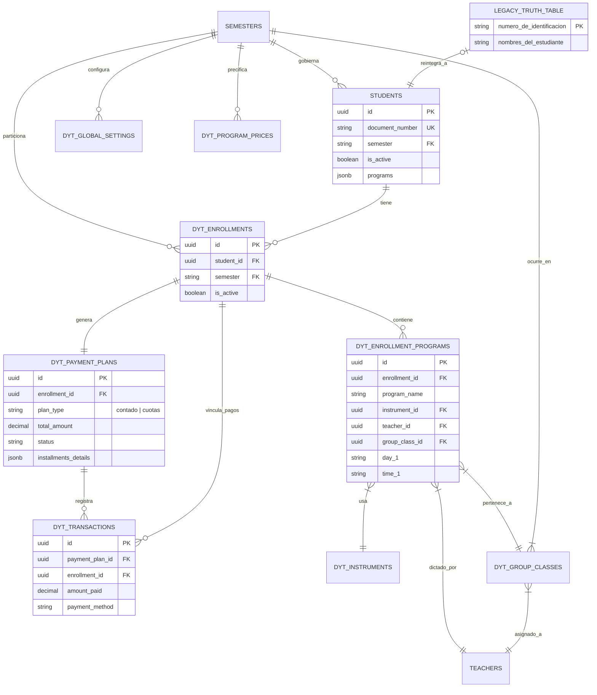

# 🗺️ OFFICE_DYT_DB_MAP: Única Fuente de Verdad (Bóveda 2026-1)

Este documento es el mapa maestro de la base de datos de **Office DYT**. Sirve como referencia técnica para agentes de IA y desarrolladores para evitar colisiones de contexto y errores de unión de tablas.

## 🏛️ Categorización de Entidades

### 1. Bóveda DYT (Prefijo `dyt_` y Tablas Modernas)
Son las tablas dinámicas que gestionan la lógica de negocio actual del semestre 2026-1 en adelante.

| Tabla | Propósito Principal | Aislamiento por `semester` |
| :--- | :--- | :--- |
| `students` | Perfiles de estudiantes consolidados. | **SÍ** |
| `dyt_enrollments` | Cabecera de matrícula por estudiante y semestre. | **SÍ** |
| `dyt_enrollment_programs` | Detalle de programas (instrumento/clase) por matrícula. | indirecto via enrollment |
| `dyt_payment_plans` | Acuerdo financiero (contado/cuotas) por matrícula. | indirecto via enrollment |
| `dyt_transactions` | Recibos de pago reales vinculados a un plan. | indirecto via enrollment |
| `dyt_global_settings` | Configuración de costos (matrícula, uniformes) por semestre. | **SÍ** |
| `dyt_program_prices` | Catálogo de precios vigentes por programa. | **SÍ** |
| `dyt_instruments` | Catálogo de instrumentos disponibles. | No |
| `dyt_group_classes` | Definición de horarios y salones para clases grupales. | **SÍ** |
| `dyt_group_program_names` | Catálogo de etiquetas para programas grupales. | **SÍ** |
| `semesters` | Entidades de tiempo que particionan el sistema. | PK |
| `teachers` | Directorio de instructores activos. | No |
| `form_responses` | Datos crudos capturados desde formularios de inscripción. | **SÍ** |
| `profiles` | Perfiles de acceso al sistema (Admin, Staff). | No |

### 2. SIA 2.0 Legacy (Herencia)
Tablas de solo lectura o sincronización que provienen del sistema anterior en Python.

| Tabla | Estado | Propósito |
| :--- | :--- | :--- |
| `Tabla_Verdad_Estudiantes` | Activa (Legacy) | Fuente de identidad para reintegración. |
| `program_prices` | Fallback | Precios antiguos usados si no hay dato en `dyt_program_prices`. |

---

## 🔗 Diagrama Entidad-Relación (ERD)

---

## 🛡️ Protocolo de Coexistencia y Aislamiento

### Política de Aislamiento del Campo `semester`
El campo `semester` **NO es opcional**. Cualquier consulta a la Bóveda DYT debe incluir un filtro explícito por semestre (actualmente `2026-1`) para evitar la mezcla de datos históricos.

- **Filtro Obligatorio**: `supabase.from('table').select('*').eq('semester', '2026-1')`
- **Tablas Críticas**: `students`, `dyt_enrollments`, `dyt_global_settings`, `dyt_program_prices`.

### Flujo de Sincronización Finance-Audit
1. Los pagos se detectan en `dyt_transactions` (o se migran desde `Tabla_Verdad_Estudiantes`).
2. Se asocian al `enrollment_id`.
3. El motor `finance.ts` reconcilia estas transacciones en el JSONB `installments_details` de `dyt_payment_plans`.
4. La visibilidad en UI depende de que el `program_id` esté vinculado en el detalle de la cuota.

### Integridad de Referencias
- Se debe usar `student_id` (UUID) para conectar con la tabla moderna `students`.
- El `document_number` solo debe usarse para búsquedas iniciales o cruces con `Tabla_Verdad_Estudiantes`.
